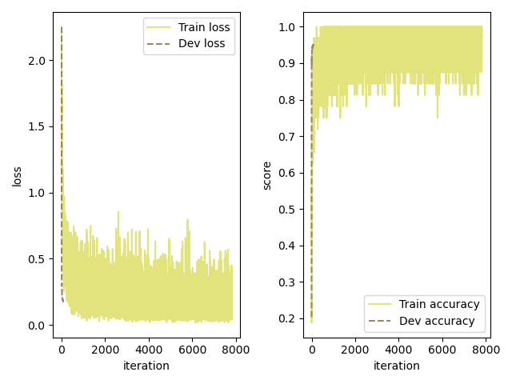
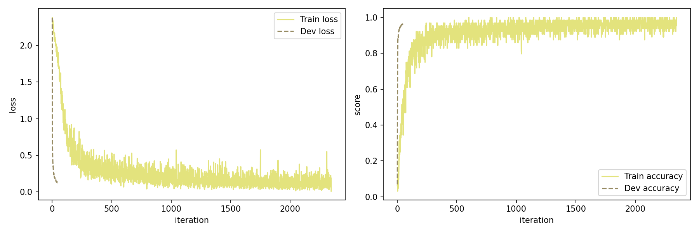
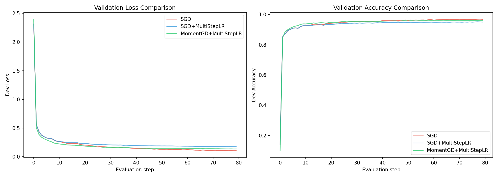
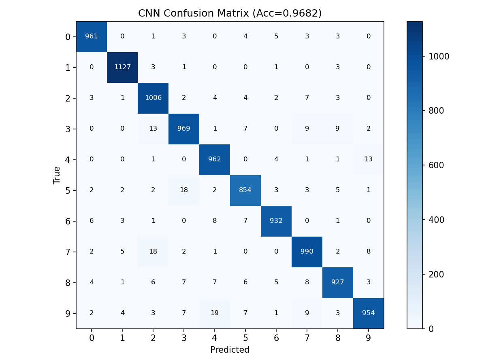
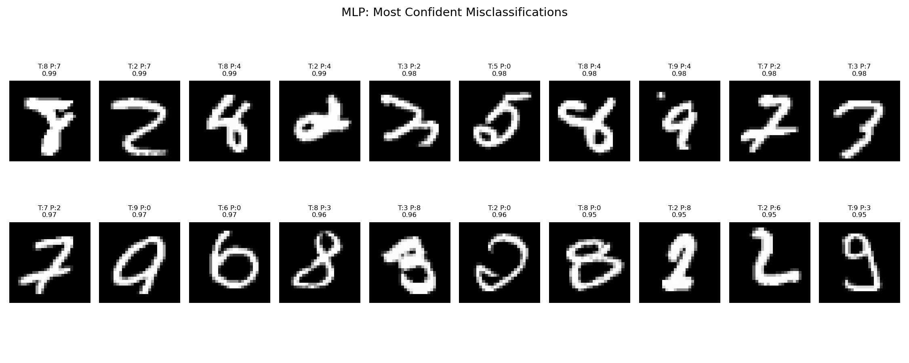
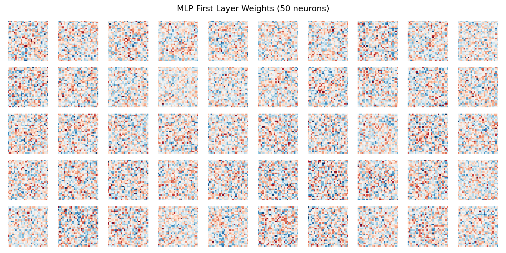
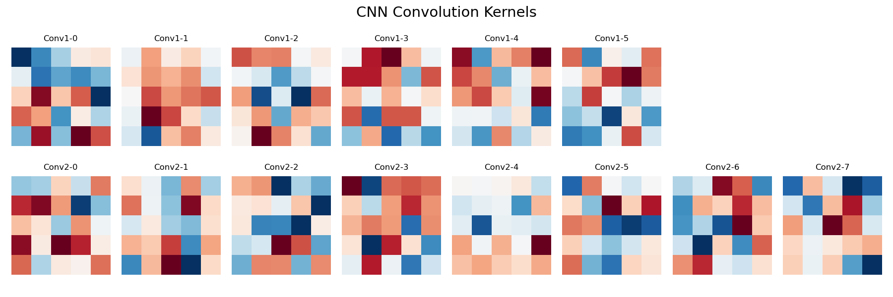

# Project 1: 基于 NumPy 从零实现 MLP 与 CNN 进行 MNIST 分类

**课程**：Neural Network and Deep Learning  
**姓名**：陈展  
**学号**：[请填写你的学号]  
**代码**：https://github.com/CZcoco/FDU_DL.git  
**模型权重**：https://modelscope.cn/models/growup/FDU-DL-PJ1-MNIST-Models/files

---

## 1. MLP Baseline

### 1.1 网络结构

MLP 的结构比较简单，参考了 starter code 中给出的框架：输入 784 维（把 28×28 的图片拉平），经过一个 600 维的隐藏层（ReLU 激活），最后输出 10 维对应 10 个数字类别。整个网络大约有 47 万个参数。

关于初始化，一开始直接用 `np.random.normal` 生成权重（starter code 原始写法），结果训练完全不收敛——loss 一直在 2.3 左右震荡，准确率停留在 10% 附近（相当于随机猜）。排查后发现是因为 784 个输入加权求和后方差太大，导致 softmax 输出饱和、梯度消失。改用 Kaiming 初始化（乘以 `sqrt(2/fan_in)`）并将 bias 初始化为 0 后，问题解决。

### 1.2 训练配置

- 优化器：SGD，学习率 0.06
- 学习率调度：MultiStepLR，在第 800、2400、4000 次迭代时将学习率减半
- Batch size：32
- 训练轮数：5 epochs
- Weight decay：1e-4
- 数据划分：从 60000 张训练图中随机取 10000 张作为验证集，剩余 50000 张训练
- 归一化：像素值除以最大值，映射到 [0, 1]

### 1.3 结果

最终验证集准确率达到 **95.1%**，测试集准确率 **95.2%**。

### 1.4 学习曲线



可以看到 loss 在前几百次迭代下降很快，之后逐渐趋于平稳。训练 accuracy 的波动比较大（因为是单个 batch 的准确率），但验证集 accuracy 比较稳定地上升。整体来看没有明显过拟合。

---

## 2. CNN 实现与 MLP-CNN 对比

### 2.1 CNN 架构设计

参考经典的 LeNet-5，设计了如下结构：

```
输入 [N,1,28,28]
  → Conv(1→6, 5×5)  → [N,6,24,24]
  → ReLU → MaxPool(2×2) → [N,6,12,12]
  → Conv(6→16, 5×5) → [N,16,8,8]
  → ReLU → MaxPool(2×2) → [N,16,4,4]
  → Flatten → [N,256]
  → Linear(256→120) → ReLU
  → Linear(120→84)  → ReLU
  → Linear(84→10)
```

总参数量大约 42000，只有 MLP 的不到 1/10。

### 2.2 卷积层实现

卷积的核心思路是 **im2col**：把每个位置的感受野 patch 展开成一列，拼成一个大矩阵，然后和 reshape 后的卷积核做矩阵乘法。这样就把卷积变成了 NumPy 擅长的矩阵运算。

backward 的时候反过来：先算出 dcol（通过 W^T @ grad），再用 col2im 把梯度散布回原始输入的形状。

实现过程中遇到一个比较隐蔽的 bug：SGD 优化器更新权重时会做 `layer.params['W'] = layer.params['W'] - lr * grads`，这会创建一个新的数组对象。但如果 forward 里写的是 `self.W`（指向初始化时的旧对象），就会导致优化器更新的权重在 forward 时根本没被使用。这个 bug 在 MLP 和 CNN 中都存在，修复方法是统一通过 `self.params['W']` 来访问权重。

正确性验证：用有限差分法 `(f(x+h) - f(x-h)) / 2h` 对 Linear 层和 conv2D 层做了梯度检查，数值梯度和解析梯度的最大差异在 1e-11 量级，确认实现正确。

### 2.3 训练配置

CNN 的训练设置和 MLP 尽量保持一致，主要区别：
- 学习率降到 0.01（CNN 梯度信号更强，大学习率容易不稳定）
- Batch size 改为 64
- 只训练了 3 epochs（纯 NumPy 的卷积循环太慢，每个 epoch 约 3 分钟）

### 2.4 对比结果

| | MLP | CNN |
|---|---|---|
| 验证集准确率 | 95.1% | **96.2%** |
| 参数量 | ~476K | ~42K |
| 每 epoch 训练时间 | ~12s | ~180s |
| 训练 epochs | 5 | 3 |

CNN 用不到 1/10 的参数，训练更少的 epoch，就超过了 MLP。如果能训练更多轮（比如 10 epochs），差距应该会更大。

### 2.5 CNN 学习曲线



### 2.6 为什么 CNN 更好

直觉上很好理解：MLP 把图片拉平成一维向量，完全丢失了像素之间的空间关系——对它来说，把图片的行打乱顺序，效果是一样的。而 CNN 通过卷积核在局部区域滑动，天然地保留了空间结构。

具体来说有几个优势：
1. **局部感受野**：每个卷积核只看一小块区域，适合检测边缘、角点这类局部特征
2. **权重共享**：同一个卷积核在所有位置复用，参数量大幅减少，也不容易过拟合
3. **平移不变性**：数字写在图片左边还是右边，同一个卷积核都能检测到
4. **层次结构**：浅层学边缘，深层组合出更复杂的模式

---

## 3. 附加方向

### 3.1 方向一：优化方法对比

#### 实验设计

想探究两个问题：(1) 动量（Momentum）对训练有什么影响？(2) 学习率调度是否总是有帮助？

在 MLP 上做了三组对比实验，尽量控制变量：

| 实验 | 优化器 | 学习率 | 调度器 |
|------|--------|--------|--------|
| 1 | SGD | 0.06 | 无 |
| 2 | SGD | 0.06 | MultiStepLR (800/2400/4000, γ=0.5) |
| 3 | MomentGD (μ=0.9) | 0.01 | MultiStepLR (800/2400/4000, γ=0.5) |

Momentum 用了更小的学习率（0.01），因为动量会累积历史梯度方向，等效学习率会变大，如果还用 0.06 很容易震荡发散。

#### 结果

| 方法 | 验证集准确率 | 训练时间 |
|------|-------------|----------|
| SGD（无调度） | **96.67%** | 58s |
| SGD + MultiStepLR | 94.98% | 55s |
| MomentGD + MultiStepLR | 95.94% | 76s |

#### 对比曲线



#### 分析

这个结果一开始让我有点意外——加了学习率调度反而变差了？

仔细看曲线后理解了原因：MultiStepLR 在第 800 次迭代就把学习率减半了，但从曲线看那时候 loss 还在快速下降，模型远没有收敛。过早降低学习率相当于"刹车太早"，限制了模型继续学习的能力。

如果要用 MultiStepLR，milestones 应该设在 loss 开始趋于平稳的位置（大概 3000-4000 次迭代之后），而不是凭经验随便设。

Momentum 的效果从曲线上看很明显：前期收敛速度快很多（绿线在前 10 个 evaluation step 就追上了红线和蓝线）。但因为学习率只有 0.01，后期的精细调优不如 lr=0.06 的 SGD 充分。这提示我们：Momentum + 合适的学习率 + 合理的调度策略，应该能获得最好的结果。

### 3.2 方向五：错误分析与可视化

#### 混淆矩阵

**MLP 混淆矩阵**（测试集准确率 95.2%）：


**CNN 混淆矩阵**：



从 MLP 的混淆矩阵可以看出一些有意思的规律：
- 数字 1 最容易识别（98.2%），大概因为它形状最简单、最独特
- 数字 5 最难（93.2%），经常被误认为 3 或 8
- 4 和 9 互相混淆很严重（各 22 例），因为手写时顶部都有一个封闭或半封闭的圈
- 7 经常被认成 2（19 例），可能是因为有些人写 7 的时候横笔比较长

#### 错误样本



挑出了模型"最自信但错误"的样本——就是 softmax 输出很高但预测错了的那些。看了之后发现，很多样本确实写得很潦草，有些连人都不太容易判断。这说明模型的错误很大程度上来自数据本身的模糊性，而不是模型能力不足。

#### 权重可视化

**MLP 第一层权重**（选取 50 个神经元，reshape 成 28×28）：



可以看到不同神经元学到了不同的"模板"——有的像是在检测竖线，有的像是在检测圆弧。这说明即使是全连接网络，也会自发地学习到一些类似"特征检测器"的东西。

**CNN 卷积核**：



CNN 第一层的 6 个 5×5 卷积核更加清晰地展示了边缘检测的模式，有水平的、垂直的、对角线方向的。这和经典图像处理中的 Sobel 算子等很相似，但这里是网络自己学出来的。

---

## 4. 结果汇总

| 实验 | 模型 | 验证集 Acc | 参数量 | 训练时间 |
|------|------|-----------|--------|----------|
| Part A baseline | MLP | 95.1% | ~476K | ~60s |
| Part B | CNN (3 epochs) | 96.2% | ~42K | ~547s |
| Part C - SGD only | MLP | 96.67% | ~476K | ~58s |
| Part C - SGD+MultiStepLR | MLP | 94.98% | ~476K | ~55s |
| Part C - MomentGD+MultiStepLR | MLP | 95.94% | ~476K | ~76s |

---

## 5. 可视化汇总

报告中包含的可视化：
- MLP 学习曲线（Section 1.4）
- CNN 学习曲线（Section 2.5）
- 三种优化方法的验证 loss/accuracy 对比曲线（Section 3.1）
- MLP 和 CNN 的混淆矩阵（Section 3.2）
- 模型最自信的错误分类样本（Section 3.2）
- MLP 第一层权重可视化（Section 3.2）
- CNN 卷积核可视化（Section 3.2）

---

## 6. 总结与思考

**关于 CNN vs MLP**：这次实验让我对"为什么要用 CNN 处理图像"有了更直观的理解。不只是理论上说"局部连接好"，而是实实在在看到：用 1/10 的参数、更少的训练时间，就能获得更好的效果。CNN 的归纳偏置（inductive bias）确实和图像数据的结构非常匹配。

**关于优化**：学习率调度不是"加了就好"的，milestones 设置不当反而会损害性能。Momentum 确实能加速收敛，但需要配合更小的学习率使用。实际工程中，这些超参数的调优可能比模型结构本身更重要。

**关于实现中的坑**：最大的教训是 Python 中对象引用的问题。`self.W` 和 `self.params['W']` 一开始指向同一个对象，但 SGD 更新时 `params['W'] = params['W'] - lr * grad` 会创建新对象，导致 forward 中用的还是旧权重。这个 bug 很隐蔽——MLP 的 loss 会下降（因为 Linear 层的 forward 也需要修复），但 CNN 的卷积层完全不学习。调试了很久才发现。

**哪些样本仍然困难**：从错误分析来看，主要是形态相似的数字对（4/9、3/8、7/2）和书写极度潦草的样本。这些本质上是数据层面的歧义，单纯增加模型容量可能帮助不大，更好的方向可能是数据增强或者集成学习。
